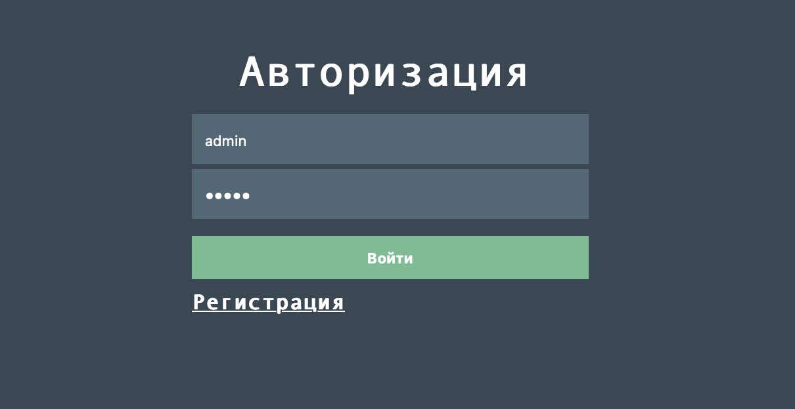
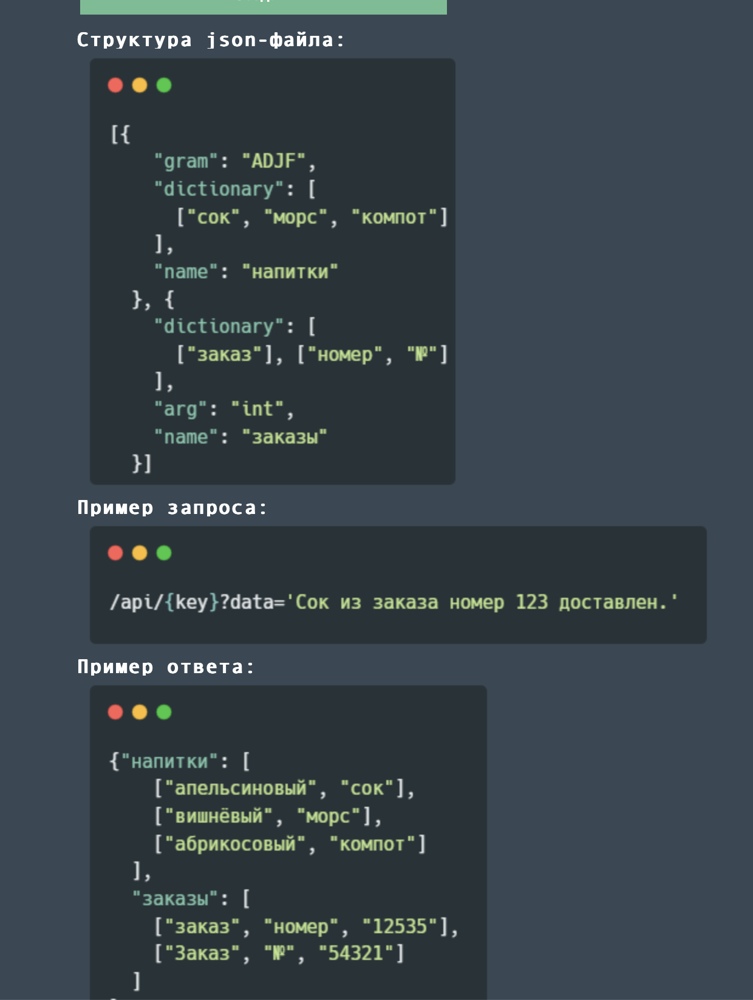
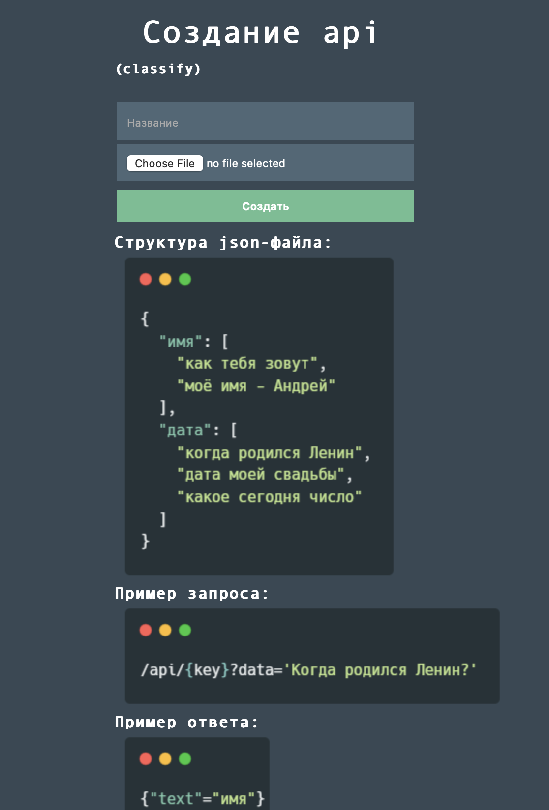

# Water Dialog - Решения для обработки текста

**Сайт для персонализации инструментов обработки текста с доступом к ним по API.**

**После авторизации пользователь выбирает инструмент и загружает на сайт свои 'настройки' для него. После этого пользователь получает доступ к своему инструменту по API**

### Реализована система авторизации:

 

### Пользователь может выбрать инструмент из доступных:
**Парсер:**

 

**Классификатор:**

 

